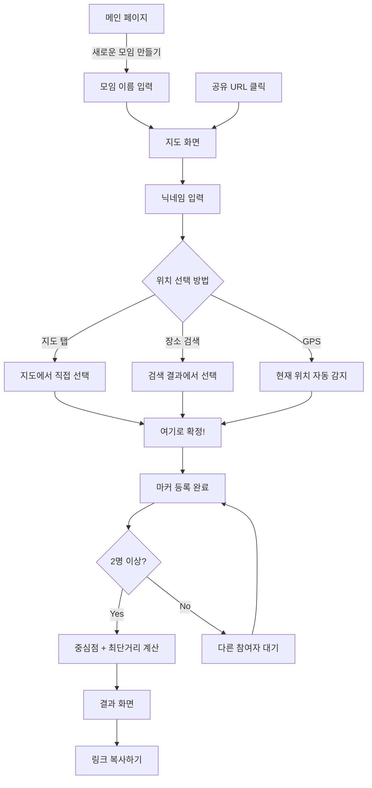

# 🗺️ 모아장소 (MoaPlace) — PRD v1.2

> **여러 사람의 위치를 모아, 최적의 중간지점을 찾아주는 서비스**

| 항목      | 내용                                                                                                                                         |
| --------- | -------------------------------------------------------------------------------------------------------------------------------------------- |
| 버전      | v1.2                                                                                                                                         |
| 작성일    | 2026.02.27                                                                                                                                   |
| 목표      | MVP 개발 — 핵심 기능 완성도 중심                                                                                                             |
| 기술 기반 | React (Vite) + PWA + Three.js                                                                                                                |
| 참고 서버 | [ticketmate-server](https://github.com/Team-TicketMate/ticketmate-server), [time-mate-server](https://github.com/Chuseok22/time-mate-server) |

---

## 목차

1. [프로젝트 개요](#1-프로젝트-개요)
2. [사용자 인터뷰 질문](#2-사용자-인터뷰-질문)
3. [페르소나 템플릿](#3-페르소나-템플릿)
4. [마이크로카피 초안](#4-마이크로카피-초안)
5. [사용자 여정 맵](#5-사용자-여정-맵)
6. [유저 플로우](#6-유저-플로우)
7. [와이어프레임](#7-와이어프레임)
8. [핵심 기능](#8-핵심-기능)
9. [핵심 로직 설명](#9-핵심-로직-설명-코드-작성-x)
10. [기술스택](#10-기술스택)
11. [폴더 구조](#11-폴더-구조)
12. [MVP 이후 추가 개선사항](#12-mvp-이후-추가-개선사항)

---

## 1. 프로젝트 개요

### 1.1 프로젝트 정의

| 항목              | 내용                                                                                                               |
| ----------------- | ------------------------------------------------------------------------------------------------------------------ |
| **프로젝트명**    | 모아장소 (MoaPlace)                                                                                                |
| **목표**          | 여러 사람의 위치를 지도에 등록하고, 모든 위치의 중심점과 최단거리 경로를 자동 계산하여 최적의 만남 장소를 제안     |
| **문제 정의**     | 친구/동료와 만날 때 중간지점을 찾는 과정이 번거로움. 각자 위치를 수동으로 공유하고 중간지점을 수작업으로 찾아야 함 |
| **핵심 가치**     | 로그인 없이, URL 공유만으로 즉시 사용 가능한 경량 위치 기반 서비스                                                 |
| **주요 사용자군** | 친구 모임, 동료/팀원 모임, 소규모 커뮤니티 모임 참가자                                                             |
| **플랫폼**        | **PWA (Progressive Web App)** — 웹 + 모바일 홈 화면 설치 지원                                                      |
| **주요 특징**     | 비로그인, 임시 데이터 저장(TTL), URL 기반 공유, 지도 마커 기반 위치 등록, Three.js 3D 확장 대비                    |

### 1.2 모아타임 vs 모아장소 비교

| 구분        | 모아타임 (MoaTime)  | 모아장소 (MoaPlace)         |
| ----------- | ------------------- | --------------------------- |
| 목적        | 공통 가능 시간 찾기 | 최적 만남 장소 찾기         |
| 입력        | 가능한 시간대 선택  | 지도에 위치 마커 찍기       |
| 출력        | 공통 시간대 표시    | 중심점 + 최단거리 경로 표시 |
| 로그인      | 없음                | 없음                        |
| 데이터 저장 | 임시 (TTL)          | 임시 (TTL)                  |
| 공유 방식   | URL 공유            | URL 공유                    |
| 3D 시각화   | 없음                | Three.js 기반 확장 예정     |

---

## 2. 사용자 인터뷰 질문

### 2.1 문제 발견 질문

| #   | 질문                                                                                | 목적                 |
| --- | ----------------------------------------------------------------------------------- | -------------------- |
| Q1  | 친구/동료와 만날 장소를 정할 때 가장 불편한 점은 무엇인가요?                        | 핵심 페인포인트 확인 |
| Q2  | 중간지점을 찾기 위해 현재 어떤 방법을 사용하고 있나요?                              | 기존 해결책 파악     |
| Q3  | 보통 몇 명이 함께 만남 장소를 정하나요?                                             | 사용자 규모 파악     |
| Q4  | 장소를 정할 때 가장 중요하게 생각하는 기준은 무엇인가요? (거리, 교통, 주변 시설 등) | 우선순위 기준 파악   |
| Q5  | 장소 선정 과정에서 갈등이 생긴 경험이 있나요? 어떻게 해결했나요?                    | 갈등 해결 니즈 파악  |

### 2.2 사용 맥락 질문

| #   | 질문                                                                                     | 목적               |
| --- | ---------------------------------------------------------------------------------------- | ------------------ |
| Q6  | 이런 서비스를 사용한다면 어떤 상황에서 쓸 것 같은가요?                                   | 사용 시나리오 확인 |
| Q7  | 로그인 없이 URL만으로 공유하는 방식에 대해 어떻게 생각하나요?                            | UX 방향 검증       |
| Q8  | 중심점 외에 추가로 보고 싶은 정보가 있나요? (주변 식당, 카페 등)                         | 부가 기능 니즈     |
| Q9  | 모바일과 PC 중 어디서 주로 사용할 것 같은가요?                                           | 플랫폼 우선순위    |
| Q10 | 결과를 받았을 때 다음으로 하고 싶은 행동은 무엇인가요?                                   | 후속 액션 파악     |
| Q11 | 지도 위에 3D로 거리나 경로가 시각화된다면 도움이 될까요?                                 | 3D 기능 니즈 검증  |
| Q12 | 이 서비스의 결과를 얼마나 신뢰할 수 있을까요? 어떤 정보가 더 있으면 신뢰도가 올라갈까요? | 신뢰 요소 파악     |

---

## 3. 페르소나 템플릿

### 3.1 페르소나 A: 모임 주최자 유형

| 항목            | 상세                                                                        |
| --------------- | --------------------------------------------------------------------------- |
| **이름 / 나이** | 김지우 / 27세                                                               |
| **직업**        | 회사원 (IT 기업)                                                            |
| **목표**        | 친구들과 모임 장소를 빠르고 공정하게 정하고 싶음                            |
| **페인포인트**  | 매번 카톡으로 각자 위치 물어보고 수동으로 중간지점 검색하는 과정이 번거로움 |
| **기술 이해도** | 높음 — 앱/웹 서비스 사용에 익숙                                             |
| **기대 사항**   | URL 하나로 모든 친구가 접속해 위치를 찍고, 중심점이 자동으로 표시되길 바람  |
| **사용 환경**   | 모바일 위주 (출퇴근 중 카톡으로 공유)                                       |

### 3.2 페르소나 B: 모임 참여자 유형

| 항목            | 상세                                                    |
| --------------- | ------------------------------------------------------- |
| **이름 / 나이** | 박수연 / 24세                                           |
| **직업**        | 대학생                                                  |
| **목표**        | 공유받은 링크를 통해 빠르게 내 위치만 찍고 싶음         |
| **페인포인트**  | 회원가입이나 앱 설치 없이 간편하게 사용하고 싶음        |
| **기술 이해도** | 보통 — 모바일 웹 사용에 익숙                            |
| **기대 사항**   | 별도 설치 없이 링크 클릭만으로 지도에 내 위치 표시 가능 |
| **사용 환경**   | 모바일 전용 (PWA 홈 화면 설치 가능)                     |

### 3.3 페르소나 C: 팀 회의 리더 유형

| 항목            | 상세                                                                                         |
| --------------- | -------------------------------------------------------------------------------------------- |
| **이름 / 나이** | 이정훈 / 34세                                                                                |
| **직업**        | 스타트업 PM                                                                                  |
| **목표**        | 원격 근무 팀원들과 오프라인 미팅 장소를 효율적으로 정하고 싶음                               |
| **페인포인트**  | 팀원들이 각기 다른 지역에 있어 공정한 중간지점 찾기가 어려움                                 |
| **기술 이해도** | 높음 — 다양한 협업 툴 사용 경험                                                              |
| **기대 사항**   | 최단거리 경로와 중심점을 동시에 확인하여 합리적 의사결정 가능, 3D 시각화로 프레젠테이션 활용 |
| **사용 환경**   | PC + 모바일 병행                                                                             |

---

## 4. 마이크로카피 초안

### 4.1 메인 화면 (방 생성)

| UI 요소               | 마이크로카피                                  | 비고               |
| --------------------- | --------------------------------------------- | ------------------ |
| 페이지 타이틀         | **모아장소** — 우리 만날 장소, 같이 찾자      | 서비스 정체성 전달 |
| CTA 버튼              | 새로운 모임 만들기                            | 핵심 액션 유도     |
| 설명 문구             | 로그인 없이 바로 시작하세요                   | 진입장벽 제거      |
| 입력 필드 placeholder | 모임 이름을 입력해주세요 (예: 주말 점심 모임) | 가이드             |
| PWA 설치 배너         | 홈 화면에 추가하면 더 빠르게 쓸 수 있어요     | PWA 설치 유도      |

### 4.2 지도 화면 (위치 등록)

| UI 요소               | 마이크로카피                       | 비고              |
| --------------------- | ---------------------------------- | ----------------- |
| 안내 문구             | 지도를 탭하여 내 위치를 찍어주세요 | 첫 접속 시 표시   |
| 닉네임 입력           | 이름 입력 (예: 홍길동)             | placeholder       |
| 위치 확정 버튼        | 여기로 확정!                       | 마커 위치 확정 시 |
| 검색 바               | 장소 검색 (예: 강남역)             | 주소/장소명 검색  |
| 현재 위치 버튼        | 내 위치로 이동                     | GPS 기반          |
| 마커 등록 완료 토스트 | ✅ 위치가 등록되었어요!            | 피드백            |

### 4.3 결과 화면

| UI 요소          | 마이크로카피                                            | 비고                         |
| ---------------- | ------------------------------------------------------- | ---------------------------- |
| 중심점 레이블    | ⭐ 모두의 중심점                                        | 별도 마커로 표시             |
| 거리 정보        | 최단거리: 12.4km (전체 경로)                            | 요약 정보                    |
| 공유 버튼        | 링크 복사하기                                           | 클립보드 복사                |
| 빈 상태 메시지   | 아직 아무도 위치를 찍지 않았어요. 첫 번째로 찍어볼까요? | 토스트/팔로워                |
| 복사 완료 토스트 | 📋 링크가 복사되었어요! 친구들에게 공유해보세요         | 복사 완료 피드백             |
| 3D 보기 토글     | 3D로 보기                                               | Three.js 3D 뷰 전환 (고도화) |

---

## 5. 사용자 여정 맵

### 5.1 주최자 여정 (Persona A)

| 단계          | 행동                              | 감정           | 터치포인트              |
| ------------- | --------------------------------- | -------------- | ----------------------- |
| **인지**      | 모임 장소를 정해야 하는 상황 발생 | 번거로움, 고민 | 카카오톡 등 메신저      |
| **진입**      | 모아장소 접속, 새 모임 생성       | 기대감, 호기심 | 웹 브라우저 (모바일/PC) |
| **설정**      | 모임 이름 입력, 본인 위치 찍기    | 집중, 기대     | 지도 화면               |
| **공유**      | URL 복사하여 친구들에게 전송      | 뿌듯함, 편리함 | 공유 버튼 + 메신저      |
| **대기**      | 친구들이 위치를 찍기를 기다림     | 약간의 불안    | 지도 실시간 업데이트    |
| **결과 확인** | 중심점과 최단거리 경로 확인       | 만족, 신뢰     | 결과 화면               |
| **의사결정**  | 중심점 근처 장소로 모임 장소 확정 | 해결감, 편안함 | 외부 지도/네비게이션    |

### 5.2 참여자 여정 (Persona B)

| 단계     | 행동                            | 감정      | 터치포인트         |
| -------- | ------------------------------- | --------- | ------------------ |
| **인지** | 친구로부터 URL 링크 수신        | 호기심    | 카카오톡 등 메신저 |
| **진입** | URL 클릭하여 지도 화면 접속     | 간편함    | 웹 브라우저        |
| **액션** | 닉네임 입력 후 지도에 위치 찍기 | 쉽고 빠름 | 지도 화면          |
| **결과** | 모든 사람의 위치와 중심점 확인  | 만족      | 결과 화면          |

---

## 6. 유저 플로우

### 6.1 방 생성 플로우 (주최자)

```
[메인 페이지 접속]
       │
       ▼
["새로운 모임 만들기" 버튼 클릭]
       │
       ▼
[모임 이름 입력 (선택)]
       │
       ▼
[지도 화면 진입]
       │
       ▼
[닉네임 입력]
       │
       ▼
[지도 탭/검색/GPS로 위치 선택]
       │
       ▼
["여기로 확정!" 버튼으로 마커 등록]
       │
       ▼
[URL 생성 → "링크 복사하기" 버튼으로 공유]
       │
       ▼
[친구들 위치 등록 대기 → 실시간 지도 업데이트 확인]
       │
       ▼
[중심점 + 최단거리 결과 확인]
```

### 6.2 참여 플로우 (참여자)

```
[공유받은 URL 클릭]
       │
       ▼
[지도 화면 진입 (기존 마커들 표시)]
       │
       ▼
[닉네임 입력]
       │
       ▼
[지도 탭/검색/GPS로 위치 선택]
       │
       ▼
["여기로 확정!" 버튼으로 마커 등록]
       │
       ▼
[중심점 + 최단거리 결과 실시간 업데이트 확인]
```

### 6.3 플로우 다이어그램 (Mermaid)



---

## 7. 와이어프레임

### 7.1 메인 화면 (홈)

```
┌─────────────────────────────────┐
│          Header                 │
│   🗺️ 모아장소                   │
├─────────────────────────────────┤
│                                 │
│                                 │
│     우리 만날 장소, 같이 찾자      │
│     로그인 없이 바로 시작하세요     │
│                                 │
│  ┌─────────────────────────┐    │
│  │  모임 이름 입력 (선택)    │    │
│  └─────────────────────────┘    │
│                                 │
│  ┌─────────────────────────┐    │
│  │   🚀 새로운 모임 만들기   │    │
│  └─────────────────────────┘    │
│                                 │
│  ┌─────────────────────────┐    │
│  │  📱 홈 화면에 추가하기    │    │
│  └─────────────────────────┘    │
│                                 │
├─────────────────────────────────┤
│  Footer: 사용법 안내 링크        │
└─────────────────────────────────┘
```

### 7.2 지도 화면 (핵심)

```
┌─────────────────────────────────┐
│  [모임이름]          👥 3명 참여  │
├─────────────────────────────────┤
│  🔍 장소 검색 (예: 강남역)       │
├─────────────────────────────────┤
│                                 │
│         ┌──────────┐            │
│         │  지도 영역 │            │
│         │  (80%)   │            │
│         │          │            │
│    📍A  │   ⭐중심  │  📍C      │
│         │          │            │
│         │  📍B     │            │
│         │          │            │
│         └──────────┘            │
│                                 │
│  ┌────┐                ┌────┐   │
│  │📍위│                │🧭내│   │
│  │치찍│                │위치│   │
│  │기  │                │이동│   │
│  └────┘                └────┘   │
├─────────────────────────────────┤
│  ▲ 하단 패널 (드래그 확장)       │
│  ──────────────────────────────│
│  ⭐ 중심점: 서울시 중구 ○○동     │
│  📏 최단거리: 12.4km            │
│  ──────────────────────────────│
│  👤 A (강남)     3.2km          │
│  👤 B (신촌)     4.1km          │
│  👤 C (잠실)     5.1km          │
│  ──────────────────────────────│
│  [🔗 링크 복사하기]              │
└─────────────────────────────────┘
```

### 7.3 닉네임 입력 모달

```
┌─────────────────────────────────┐
│                                 │
│   ┌─────────────────────────┐   │
│   │                         │   │
│   │   이름을 입력해주세요      │   │
│   │                         │   │
│   │  ┌───────────────────┐  │   │
│   │  │  (예: 홍길동)       │  │   │
│   │  └───────────────────┘  │   │
│   │                         │   │
│   │  [        확인        ]  │   │
│   │                         │   │
│   └─────────────────────────┘   │
│                                 │
└─────────────────────────────────┘
```

### 7.4 위치 확정 바텀시트

```
┌─────────────────────────────────┐
│         (지도 영역)              │
│             📍                  │
├─────────────────────────────────┤
│                                 │
│   서울특별시 강남구 역삼동 123     │
│   (선택한 위치 주소)              │
│                                 │
│   [      여기로 확정!      ]     │
│   [        취소           ]     │
│                                 │
└─────────────────────────────────┘
```

---

## 8. 핵심 기능

### 8.1 기능 우선순위 매트릭스

| 우선순위      | 기능명                 | 설명                                                                   | 상태   |
| ------------- | ---------------------- | ---------------------------------------------------------------------- | ------ |
| **P0 (필수)** | 방 생성 및 URL 생성    | UUID 기반 방 생성, 공유 가능한 고유 URL 자동 생성                      | MVP    |
| **P0 (필수)** | 지도 표시 및 마커 등록 | Google Maps API를 통한 지도 렌더링, 탭/검색/GPS로 위치 마커 등록       | MVP    |
| **P0 (필수)** | 중심점 계산            | 모든 마커의 좌표 평균으로 기하학적 중심점 계산 후 지도에 표시          | MVP    |
| **P0 (필수)** | 최단거리 경로 계산     | 모든 마커를 잇는 최단거리 경로(TSP 근사) 계산 및 지도 위 폴리라인 표시 | MVP    |
| **P0 (필수)** | URL 공유 (Link Share)  | URL 클립보드 복사 및 공유 기능                                         | MVP    |
| **P1 (중요)** | 실시간 마커 동기화     | 다른 참여자가 위치를 찍으면 실시간 지도 업데이트 (Polling/SSE)         | MVP    |
| **P1 (중요)** | 임시 데이터 관리       | TTL 기반 임시 데이터 저장 및 자동 만료 (24시간)                        | MVP    |
| **P1 (중요)** | PWA 지원               | Service Worker, 매니페스트, 오프라인 기본 화면, 홈 화면 설치           | MVP    |
| **P2 (보조)** | 장소 검색              | 주소/장소명 검색 및 자동완성                                           | MVP    |
| **P2 (보조)** | GPS 현재 위치          | 브라우저 Geolocation API로 현재 위치 자동 감지                         | MVP    |
| **P3 (확장)** | Three.js 3D 뷰         | 마커, 경로, 중심점을 3D 공간에서 시각화                                | 고도화 |

### 8.2 API 엔드포인트 설계

| Method   | Endpoint                                 | 설명                          |
| -------- | ---------------------------------------- | ----------------------------- |
| `POST`   | `/api/rooms`                             | 방 생성 (UUID 발급)           |
| `GET`    | `/api/rooms/{roomId}`                    | 방 정보 조회 (마커 목록 포함) |
| `POST`   | `/api/rooms/{roomId}/markers`            | 마커 등록                     |
| `DELETE` | `/api/rooms/{roomId}/markers/{markerId}` | 마커 삭제                     |
| `GET`    | `/api/rooms/{roomId}/result`             | 중심점 + 최단거리 계산 결과   |

---

## 9. 핵심 로직 설명 (코드 작성 X)

### 9.1 중심점 계산 로직

모든 마커의 좌표(latitude, longitude)를 수집한 후, 각각의 산술 평균을 계산하여 기하학적 중심점(Geometric Centroid)을 구합니다.

```
centroid_lat = (lat1 + lat2 + ... + latN) / N
centroid_lng = (lng1 + lng2 + ... + lngN) / N
```

이 중심점은 새로운 마커가 추가/삭제될 때마다 실시간으로 재계산됩니다. 향후 개선으로는 지구 곡률을 반영한 Haversine 기반 가중 중심점을 고려할 수 있습니다.

### 9.2 최단거리 경로 계산 로직 (TSP 근사)

모든 마커를 연결하는 최단거리 경로는 TSP(Travelling Salesman Problem)의 변형입니다.

**참여자 수가 적을 때 (10명 이하):** Brute-force 순열 탐색으로 정확한 최단거리를 계산합니다. 10명 이하의 순열 탐색은 10! = 3,628,800번으로 충분히 빠릅니다.

**참여자 수가 많을 때 (10명 초과):** Nearest Neighbor 휴리스틱으로 근사 최단거리를 계산합니다. 시작점을 한 번씩 바꿔가며 가장 짧은 경로를 채택합니다.

거리 계산에는 **Haversine 공식**을 사용하여 두 좌표 사이의 실제 지표면 거리를 계산합니다.

```
a = sin²(Δlat/2) + cos(lat1) × cos(lat2) × sin²(Δlng/2)
c = 2 × atan2(√a, √(1-a))
distance = R × c    (R = 지구 반지름 6,371km)
```

### 9.3 임시 데이터 저장 로직

time-mate-server 패턴을 참고하여, UUID 기반의 방 식별자를 생성하고 Redis에 TTL(Time To Live) 24시간으로 저장합니다.

- 방 생성 시 UUID가 URL 경로에 포함되어 공유 링크가 됩니다
  - 예: `https://moaplace.com/room/550e8400-e29b-41d4-a716-446655440000`
- 24시간 후 자동으로 데이터가 삭제되므로 별도의 회원 관리나 장기 저장이 불필요합니다
- Redis Hash 구조로 방 정보와 마커 목록을 하나의 키에 저장합니다

### 9.4 실시간 동기화 로직

MVP에서는 **Short Polling** 방식을 사용합니다.

- 클라이언트가 3초 간격으로 서버에 GET 요청을 보내 현재 방의 마커 목록을 가져옵니다
- 새 마커가 추가되면 중심점과 최단거리를 재계산하여 UI를 업데이트합니다
- 향후 SSE(Server-Sent Events) 또는 WebSocket으로 전환 가능합니다

### 9.5 PWA 구현 로직

React + Vite 환경에서 `vite-plugin-pwa`를 활용하여 PWA를 구현합니다.

- **Service Worker:** Workbox 기반 자동 생성. 정적 자산(JS, CSS, 이미지)을 프리캐시하고, API 응답은 네트워크 우선(Network First) 전략으로 처리합니다
- **Web App Manifest:** 앱 이름, 아이콘(192x192, 512x512), 테마 컬러, 시작 URL, 디스플레이 모드(standalone) 등을 정의합니다
- **설치 프롬프트:** `beforeinstallprompt` 이벤트를 캐치하여 커스텀 설치 배너를 표시합니다
- **오프라인 폴백:** 네트워크 미연결 시 오프라인 안내 페이지를 표시합니다. 지도 기능 자체는 온라인 필수이므로, 마지막으로 본 결과의 스냅샷 정도만 캐시합니다

### 9.6 Three.js 3D 시각화 로직 (고도화)

고도화 단계에서 Three.js를 `@react-three/fiber`로 통합하여 다음을 구현합니다.

- **3D 지형 맵:** 2D 지도 위에 Three.js Canvas를 오버레이하여 높이감 있는 시각화
- **마커 3D 오브젝트:** 각 참여자의 마커를 3D 핀으로 표현, 호버 시 정보 팝업
- **경로 3D 라인:** 최단거리 경로를 3D 공간의 곡선(TubeGeometry)으로 표현
- **중심점 이펙트:** 중심점에 파티클 또는 글로우 이펙트로 시각적 강조
- **카메라 컨트롤:** OrbitControls로 사용자가 3D 뷰를 자유롭게 회전/줌 가능
- **2D ↔ 3D 토글:** 사용자가 버튼 하나로 일반 지도 뷰와 3D 뷰를 전환

React(Vite) 환경에서는 SSR 이슈가 없으므로 `@react-three/fiber`를 직접 import하여 사용할 수 있습니다. 이는 React를 선택한 주요 이점 중 하나입니다.

---

## 10. 기술스택

### 10.1 프론트엔드

| 구분           | 기술                                                  | 선정 이유                                                       |
| -------------- | ----------------------------------------------------- | --------------------------------------------------------------- |
| **빌드 도구**  | **Vite**                                              | 빠른 HMR, 간편한 설정, PWA 플러그인 생태계                      |
| **프레임워크** | **React 18**                                          | 컴포넌트 기반 UI, Three.js 통합 용이 (SSR 이슈 없음)            |
| **라우팅**     | **React Router v6**                                   | SPA 라우팅, 동적 경로 (`/room/:id`) 지원                        |
| **언어**       | **TypeScript**                                        | 타입 안정성, 개발 생산성 향상                                   |
| **스타일링**   | **Tailwind CSS**                                      | 빠른 UI 개발, 리스폰시브 디자인                                 |
| **상태 관리**  | **Zustand**                                           | 경량 상태 관리, 보일러플레이트 최소화                           |
| **지도**       | **@vis.gl/react-google-maps**                         | Google Maps React 공식 라이브러리, 글로벌 대응, Places API 연동 |
| **3D**         | **Three.js + @react-three/fiber + @react-three/drei** | 3D 시각화, React 생태계 통합, 유틸리티 헬퍼                     |
| **PWA**        | **vite-plugin-pwa**                                   | Vite 네이티브 통합, Workbox 자동 설정                           |
| **HTTP 통신**  | **Axios**                                             | API 통신 및 Polling 구현                                        |

### 10.2 백엔드

| 구분            | 기술                    | 선정 이유                                           |
| --------------- | ----------------------- | --------------------------------------------------- |
| **프레임워크**  | **Spring Boot 3.x**     | ticketmate/time-mate 서버 참고, 팀 기술 스택 일관성 |
| **언어**        | **Java 17+**            | 안정성, 장기 지원 버전                              |
| **데이터 저장** | **Redis**               | TTL 기반 임시 데이터 저장에 최적화                  |
| **API 스타일**  | **RESTful API**         | 단순한 CRUD 구조, 표준 HTTP 메서드 활용             |
| **API 문서**    | **Swagger (SpringDoc)** | API 문서 자동화                                     |

### 10.3 인프라 및 기타

| 구분          | 기술                        | 선정 이유                             |
| ------------- | --------------------------- | ------------------------------------- |
| **FE 배포**   | **Vercel**                  | Vite 정적 빌드 배포 최적화, 무료 티어 |
| **BE 배포**   | **AWS EC2 / Railway**       | 서버 운영, 무료/저가 티어 활용        |
| **컨테이너**  | **Docker + docker-compose** | 환경 일관성 (Redis + App)             |
| **CI/CD**     | **GitHub Actions**          | 자동 빌드/배포 파이프라인             |
| **버전 관리** | **Git + GitHub**            | 협업 및 코드 관리                     |

### 10.4 주요 npm 패키지 요약

```
# 핵심
react, react-dom, react-router-dom, typescript

# 스타일
tailwindcss, postcss, autoprefixer

# 상태 / 통신
zustand, axios

# 지도
@vis.gl/react-google-maps

# 3D
three, @react-three/fiber, @react-three/drei

# PWA
vite-plugin-pwa, workbox-window

# 개발
vite, @vitejs/plugin-react, eslint, prettier
```

---

## 11. 폴더 구조

### 11.1 프론트엔드 (React + Vite + PWA)

```
moaplace-client/
├── public/
│   ├── manifest.json               # PWA 매니페스트
│   ├── icons/                      # PWA 아이콘 (192x192, 512x512)
│   │   ├── icon-192x192.png
│   │   └── icon-512x512.png
│   └── favicon.ico
├── src/
│   ├── main.tsx                    # 엔트리 포인트
│   ├── App.tsx                     # React Router 설정
│   ├── pages/                      # 페이지 컴포넌트
│   │   ├── HomePage.tsx            # 메인 (홈)
│   │   └── RoomPage.tsx            # 지도 화면 (방 상세)
│   ├── components/                 # UI 컴포넌트
│   │   ├── Map/                    # 2D 지도 관련
│   │   │   ├── MapView.tsx         # 지도 렌더링 (Google Maps)
│   │   │   ├── Marker.tsx          # 마커 컴포넌트
│   │   │   ├── CenterPoint.tsx     # 중심점 마커
│   │   │   └── RouteLine.tsx       # 최단거리 폴리라인
│   │   ├── Three/                  # Three.js 3D 컴포넌트
│   │   │   ├── Scene3D.tsx         # R3F Canvas + 씬 컨테이너
│   │   │   ├── Marker3D.tsx        # 3D 마커 오브젝트
│   │   │   ├── Route3D.tsx         # 3D 경로 라인 (TubeGeometry)
│   │   │   ├── CenterEffect.tsx    # 중심점 파티클/글로우 이펙트
│   │   │   └── Controls.tsx        # OrbitControls 래퍼
│   │   ├── Panel/                  # 하단 패널
│   │   │   ├── ResultPanel.tsx     # 결과 패널 (중심점 + 거리)
│   │   │   └── ParticipantList.tsx # 참여자 목록
│   │   ├── Common/                 # 공통 UI
│   │   │   ├── Button.tsx
│   │   │   ├── Input.tsx
│   │   │   ├── Toast.tsx
│   │   │   ├── Modal.tsx
│   │   │   └── PWAInstallBanner.tsx # PWA 설치 유도 배너
│   │   └── Home/
│   │       └── CreateRoom.tsx      # 방 생성 폼
│   ├── hooks/                      # 커스텀 훅
│   │   ├── useMap.ts               # 지도 조작 (줌, 패닝, 마커 관리)
│   │   ├── useRoom.ts             # 방 데이터 Polling (3초 간격)
│   │   ├── useGeolocation.ts       # GPS 현재 위치
│   │   ├── usePWA.ts              # PWA 설치 상태 + beforeinstallprompt
│   │   └── useThreeView.ts        # 2D ↔ 3D 토글 상태
│   ├── lib/                        # 유틸리티 / 핵심 로직
│   │   ├── api.ts                  # Axios 기반 API 클라이언트
│   │   ├── centroid.ts             # 중심점 계산 (산술 평균)
│   │   ├── tsp.ts                  # TSP 최단거리 계산 (Brute-force + NN)
│   │   ├── haversine.ts            # Haversine 거리 계산
│   │   └── clipboard.ts           # 클립보드 복사 유틸
│   ├── store/                      # Zustand 상태 관리
│   │   ├── roomStore.ts            # 방 + 마커 상태
│   │   └── uiStore.ts             # UI 상태 (모달, 토스트, 3D 토글)
│   ├── types/                      # TypeScript 타입 정의
│   │   └── index.ts                # Room, Marker, Centroid 등
│   └── styles/
│       └── globals.css             # Tailwind 전역 스타일
├── index.html
├── vite.config.ts                  # Vite + vite-plugin-pwa 설정
├── tailwind.config.ts
├── tsconfig.json
├── .env                            # VITE_GOOGLE_MAPS_API_KEY 등
└── package.json
```

### 11.2 백엔드 (Spring Boot)

```
moaplace-server/
├── src/main/java/com/moaplace/
│   ├── MoaPlaceApplication.java
│   ├── controller/
│   │   └── RoomController.java         # 방 CRUD + 마커 API
│   ├── service/
│   │   ├── RoomService.java            # 방 비즈니스 로직
│   │   └── CalculationService.java     # 중심점 / TSP 계산
│   ├── dto/
│   │   ├── RoomCreateRequest.java
│   │   ├── RoomResponse.java
│   │   ├── MarkerRequest.java
│   │   └── ResultResponse.java         # 중심점 + 경로 결과
│   ├── domain/
│   │   ├── Room.java                   # 방 도메인
│   │   └── Marker.java                 # 마커 도메인
│   ├── repository/
│   │   └── RoomRepository.java         # Redis 저장소
│   └── config/
│       ├── RedisConfig.java
│       ├── CorsConfig.java
│       └── SwaggerConfig.java
├── src/main/resources/
│   └── application.yml
├── build.gradle
├── Dockerfile
└── docker-compose.yml                  # Redis + App
```

### 11.3 로컬 개발 환경 가이드

#### Redis 환경: Docker 컨테이너 사용

로컬 개발 시 Redis는 Docker 컨테이너로 운영합니다. OS별 설치 차이 없이 팀 전원이 동일한 환경을 보장받을 수 있고, 배포 환경(EC2/Railway)과 동일한 구성이 되어 환경 차이로 인한 이슈를 사전에 방지합니다.

#### docker-compose.yml 구성

```yaml
version: "3.8"

services:
  redis:
    image: redis:7-alpine
    container_name: moaplace-redis
    ports:
      - "6379:6379"
    volumes:
      - redis-data:/data
    command: redis-server --maxmemory 128mb --maxmemory-policy allkeys-lru
    restart: unless-stopped

  # 배포 시에만 사용 (로컬에서는 IDE로 Spring Boot 직접 실행)
  app:
    build: .
    container_name: moaplace-server
    ports:
      - "8080:8080"
    depends_on:
      - redis
    environment:
      SPRING_DATA_REDIS_HOST: redis
      SPRING_DATA_REDIS_PORT: 6379
    profiles:
      - deploy # docker-compose --profile deploy up 으로만 실행

volumes:
  redis-data:
```

#### application.yml (Spring Boot)

```yaml
spring:
  data:
    redis:
      host: localhost # 로컬 개발 시 (Docker Redis → localhost:6379)
      port: 6379

# 배포 환경에서는 환경변수로 오버라이드
# SPRING_DATA_REDIS_HOST=redis
```

#### 로컬 개발 워크플로우

```
# 1단계: Redis만 컨테이너로 띄우기
docker-compose up redis -d

# 2단계: Redis 정상 동작 확인
docker exec -it moaplace-redis redis-cli ping
# → PONG 응답 확인

# 3단계: Spring Boot는 IntelliJ/VS Code에서 직접 실행
#         → 디버깅, 핫리로드, 브레이크포인트 자유롭게 사용 가능

# 4단계: 프론트엔드 개발 서버 실행
cd moaplace-client
npm run dev
# → http://localhost:5173

# 개발 종료 시
docker-compose down
```

#### 이 구조의 핵심 이점

| 항목                            | 설명                                                            |
| ------------------------------- | --------------------------------------------------------------- |
| **Redis = Docker**              | OS 무관 동일 환경, 버전 통일 (Redis 7), 설치/삭제 깔끔          |
| **Spring Boot = IDE 직접 실행** | 디버깅 자유도 확보, HotSwap 활용 가능                           |
| **React = Vite 개발 서버**      | HMR로 빠른 피드백 루프                                          |
| **배포 시**                     | `docker-compose --profile deploy up`으로 전체 컨테이너화        |
| **팀 환경 통일**                | `docker-compose up redis -d` 한 줄이면 누구든 동일한 Redis 환경 |

#### Redis 데이터 확인 (개발 중 유용한 명령어)

```bash
# Redis CLI 접속
docker exec -it moaplace-redis redis-cli

# 전체 키 조회
KEYS *

# 특정 방 데이터 조회
HGETALL room:{roomId}

# TTL 확인 (남은 만료 시간)
TTL room:{roomId}

# 수동 데이터 삭제 (테스트용)
DEL room:{roomId}

# 전체 데이터 초기화 (개발 리셋)
FLUSHALL
```

---

## 12. MVP 이후 추가 개선사항

### Phase 1 (MVP 직후)

| 개선사항                         | 설명                                                                        | 기대 효과                  |
| -------------------------------- | --------------------------------------------------------------------------- | -------------------------- |
| **SSE/WebSocket 실시간 통신**    | Polling → SSE 또는 WebSocket으로 전환하여 진정한 실시간 동기화              | 응답 속도 및 UX 향상       |
| **Three.js 3D 뷰 구현**          | @react-three/fiber로 마커/경로/중심점을 3D 공간에서 시각화, 2D↔3D 토글 기능 | 차별화된 UX, 시각적 임팩트 |
| **중심점 주변 시설 추천**        | 중심점 근처 식당, 카페, 지하철역 등 POI 정보 표시                           | 의사결정 지원              |
| **교통수단 기반 실제 거리 계산** | Haversine 직선거리 → Google Directions API 활용 실제 경로 계산              | 정확도 향상                |

### Phase 2 (안정화 후)

| 개선사항                | 설명                                                    | 기대 효과     |
| ----------------------- | ------------------------------------------------------- | ------------- |
| **가중 중심점 계산**    | 교통편의성, 인구밀도 등을 고려한 스마트 중심점 계산     | 실용성 향상   |
| **마커 수정/삭제 기능** | 등록한 마커의 위치 변경 및 삭제 기능                    | 유연성 향상   |
| **3D 지형 렌더링**      | Three.js로 실제 지형 고도 데이터(DEM) 기반 3D 맵 렌더링 | 시각적 완성도 |
| **다크 모드**           | 시스템 설정 연동 다크/라이트 모드 전환                  | 접근성 향상   |

### Phase 3 (성장기)

| 개선사항                         | 설명                                                      | 기대 효과     |
| -------------------------------- | --------------------------------------------------------- | ------------- |
| **불공정 지수 표시**             | 각 참여자의 중심점까지 거리 편차를 시각화하여 공정성 표시 | 투명성 향상   |
| **다양한 공유 방식**             | QR 코드 공유, 카카오톡 직접 공유                          | 접근성 향상   |
| **히스토리 기능 (localStorage)** | 이전에 사용한 방 목록을 브라우저 localStorage에 저장      | 재사용성 향상 |
| **3D AR 뷰**                     | Three.js + WebXR로 AR 기반 실세계 위치 오버레이           | 혁신적 UX     |
| **다국어 지원 (i18n)**           | 영어, 일본어 등 다국어 UI 지원 (react-i18next)            | 글로벌 확장   |

---
